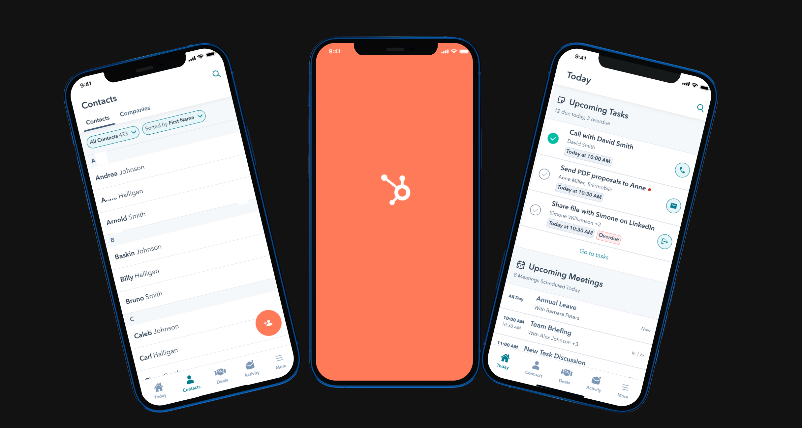

# HubSpot

<div>
<strong>

A Flutter Application, Built with ❤️ from [DhiWise](https://www.dhiwise.com/)

</strong>

<h4>This is a HubSpot clone Application built with Flutter.

It uses [HubSpot APIs](https://developers.hubspot.com/docs/api/overview) to store and retrieve data.</h4>

</div>

## System Requirements

Dart SDK Version 2.17.0 or greater.

Flutter SDK Version 3.0.0 or greater.

## Figma Design
https://www.figma.com/file/ujTezE27M27qtduON3i7jI/DhiWise-Use-Cases?node-id=4013%3A1069

### HubSpot APIs Collections

1. Tasks
2. Deals
3. Meetings
4. Contacts
5. Companies
6. Owners
7. Pipelines
8. Associations

## Application Screens


## Application Features

1. List of today's upcoming tasks.
2. List of today's upcoming meetings.
3. List of due tasks with filter and sorting.
4. List of future tasks with filter and sorting.
5. Create new task.
6. List of contacts and companies with filter and sorting.
7. List of deals with filter and sorting.
8. Create new deal.
9. List Of email activities.

## Run the application.

1. Replace hapikey in appConfig.dart inside lib/core/constants.

2. ```Flutter pub get ```

3. ``` Flutter run ```


## Folder Structure

```
├── android - contains files and folders required for running the application on an Android operating system.
├── assets - contains all images and fonts of your application.
├── ios - contains files required by the application to run the dart code on iOS platforms.
├── lib - Most important folder in the project, used to write most of the dart code.
├── main.dart - starting point of the application
├── core
│ ├── app_export.dart - contains commonly used file imports
│ ├── constants - contains all constants classes
│ ├── errors - contains error handling classes
│ ├── network - contains network related classes
│ └── utils - contains common files and utilities of project
├── data
│ ├── apiClient - contains api calling methods
│ ├── models - contains request/response models
│ └── repository - network repository
├── localization - contains localization classes
├── presentation - contains all screens and screen controllers
│ └── screens - contains all screens
├── routes - contains all the routes of application
└── theme - contains app theme and decoration classes

```

## MIT License

Copyright (c) 2022 DhiWise

Permission is hereby granted, free of charge, to any person obtaining a copy
of this software and associated documentation files (the "Software"), to deal
in the Software without restriction, including without limitation the rights
to use, copy, modify, merge, publish, distribute, sublicense, and/or sell
copies of the Software, and to permit persons to whom the Software is
furnished to do so, subject to the following conditions:

The above copyright notice and this permission notice shall be included in all
copies or substantial portions of the Software.

## Support

[DhiWise Discord Community](https://discord.gg/hTuNauNjyJ)
